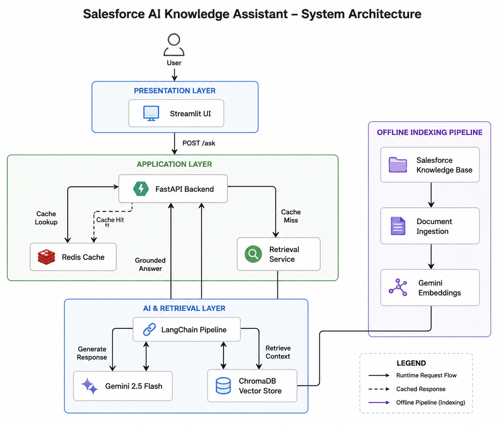
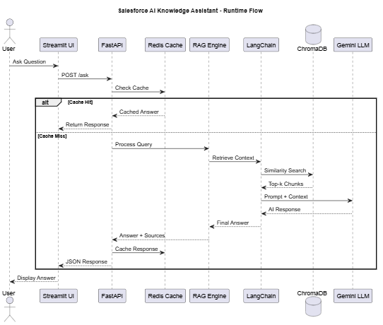

# 🚀 Salesforce AI Knowledge Assistant using Retrieval-Augmented Generation (RAG)


An enterprise-grade **Retrieval-Augmented Generation (RAG)** application that enables natural language querying over Salesforce documentation using **Gemini 2.5 Flash**, **LangChain**, **ChromaDB**, **FastAPI**, **Redis**, and **Streamlit**.

The application retrieves semantically relevant Salesforce documentation, augments LLM prompts with retrieved context, and generates grounded AI responses while using Redis caching to improve response times for repeated queries.

---

# 📖 Project Overview

This project demonstrates an end-to-end enterprise AI architecture that combines semantic search, vector databases, REST APIs, response caching, and large language models to build an intelligent Salesforce knowledge assistant.

Users can ask Salesforce-related questions in natural language, and the system retrieves the most relevant documentation before generating an accurate, context-aware response.

---

# 🏗️ System Architecture

The application is organized into four logical layers:

- Presentation Layer
- Application Layer
- AI & Retrieval Layer
- Offline Indexing Pipeline

<p align="center">

</p>

---

# ⚡ Runtime Flow

The sequence diagram illustrates the lifecycle of every user request.

1. User submits a question.
2. FastAPI checks Redis for cached responses.
3. On a cache miss, the Retrieval Service invokes LangChain.
4. LangChain retrieves relevant document chunks from ChromaDB.
5. Gemini 2.5 Flash generates a grounded response.
6. The response is cached and returned to the user.

<p align="center">

</p>

---

# ✨ Features

- 🤖 AI-powered Salesforce Knowledge Assistant
- 🔍 Retrieval-Augmented Generation (RAG)
- 🧠 Semantic Search using ChromaDB
- ⚡ Gemini 2.5 Flash Integration
- 🔗 LangChain Retrieval Pipeline
- 🚀 FastAPI REST Backend
- 🎨 Streamlit Web Interface
- 💾 Redis Response Caching
- 📄 Offline Document Ingestion
- 📚 Source Citation Support

---

# 🛠 Technology Stack

| Layer | Technologies |
|--------|--------------|
| Frontend | Streamlit |
| Backend | FastAPI, Python |
| AI | Gemini 2.5 Flash |
| Orchestration | LangChain |
| Vector Database | ChromaDB |
| Embeddings | Gemini Embeddings |
| Cache | Redis |
| API | REST |
| Containerization | Docker |
| Knowledge Base | Salesforce Documentation |

---

# 🌐 API Endpoints

| Method | Endpoint | Description |
|----------|----------|------------|
| POST | `/ask` | Ask Salesforce questions |
| GET | `/health` | Backend health check |

---

# 📨 Example Request

```json
POST /ask

{
    "question": "Explain Governor Limits in Salesforce."
}
```

---

# 📤 Example Response

```json
{
    "answer": "Governor Limits ensure efficient resource utilization by limiting resource consumption within Salesforce transactions.",
    "cached": false,
    "sources": [
        {
            "source": "Salesforce_Notes.txt",
            "content": "..."
        }
    ]
}
```

---

# 📂 Project Structure

```text
Salesforce-AI-Assistant/
│
├── app.py
├── api.py
├── rag.py
├── ingest.py
├── redis_client.py
├── Salesforce_Notes.txt
├── chroma_db/
├── images/
│   ├── architecture.png
│   └── runtime-flow.png
├── requirements.txt
└── README.md
```

---

# 🚀 Installation

```bash
git clone https://github.com/Rrahul04/Salesforce-AI-Assistant.git

cd Salesforce-AI-Assistant

python -m venv venv

# Windows
venv\Scripts\activate

# Linux/macOS
source venv/bin/activate

pip install -r requirements.txt

python ingest.py

docker run -d -p 6379:6379 redis:7-alpine

uvicorn api:app --reload

streamlit run app.py
```

---

# 📸 Application

Add screenshots of the Streamlit interface here.

Example:

- Home Screen
- AI Response
- Retrieved Sources

---

# 📈 Results

- ✅ Grounded AI responses using Gemini 2.5 Flash
- ✅ Semantic document retrieval with ChromaDB
- ✅ Faster repeated queries using Redis caching
- ✅ RESTful backend powered by FastAPI
- ✅ Interactive web interface built with Streamlit

---

# 💡 Future Enhancements

- Hybrid Search (BM25 + Vector Search)
- Multi-document ingestion (PDF, DOCX)
- Conversational Memory
- JWT Authentication
- Docker Compose
- AWS Deployment
- GitHub Actions CI/CD
- Observability & Logging
- Multi-user Sessions

---

# 📚 Key Learnings

This project provided hands-on experience with:

- Retrieval-Augmented Generation (RAG)
- LangChain
- ChromaDB
- Gemini API
- Prompt Engineering
- FastAPI
- Redis
- Semantic Search
- Streamlit
- AI System Design

---

# 📜 License

This project is licensed under the MIT License.

---

# 👨‍💻 Author

**Rahul Raina**

Software Engineer | Backend Development | AI Engineering | Cloud

⭐ If you found this project useful, consider starring the repository.